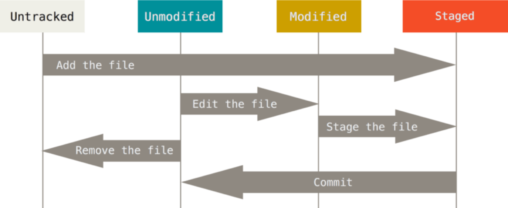

# c04 - Git and GitHub

## Review

In this class we continue our discussion of the basics of local repository management.

Remember the stages of files in a git repository:

Last class, we saw these workflows:

1. Create git repository (`git init`)
1. Stage files (`git add`)
1. Commit files (`git commit`)
1. Check status (`git status`)
1. Review commit log (`git log`)

For today, you should have read sections 2.1 through 2.5 of the ProGit online book
https://git-scm.com/book/en/v2

## Today

Today we will add these key workflows/tasks:

1. Cloning a repo from Github
1. Rolling back changes.
1. Managing experimental/test changes to your released code.

By end of class you should know how to:

1. Initialize a repo, add files to staging area, and commit files to your repository.
2. Reset your repository to a previous commit point (only use this as a last resort -- proper branch management should help you avoid needing to do this)
3. List all branches, create a branch, know which branch you are one, and switch between branches.

### Today's Topics

1. [Cloning your Student Repo](1.cloning_class_repo.md)
1. [Git Rollback](2.git_rollback.md)
1. [Git Experimental Branch](3.git_experimental_branch.md)

## Upcoming Test 1

For test 1 you should know:
* c03:
   * Initialize a repo from a local directory, and from a clone from GitHub
   * Add files for staging
   * Commit files with messages
* c04 (today):
   * Create a new Branch, switch between them
   * Merge branches, Delete Branches
   * Rollback a commit, amend a commit
   * Push and pull content to/from GitHub
* c05 (Wednesday):
   * Open and edit files in Atom
   * Create MD (markdown) file using Atom
* c06 (Friday) - Test 1 is an open book test. You can use the internet to look things up, but cannot ask questions on the internet or share any content between classmates.
See class notes and https://git-scm.com/book/en/v2 sections 2.1 through 2.5 and sections 3.1 through 3.3

## Related Topics (Not covered in class)

1. [Joining an existing repo to github](supplemental1.adding_existing_repo.md)
1. [Creating releases](supplemental2.Create_releases.md)
