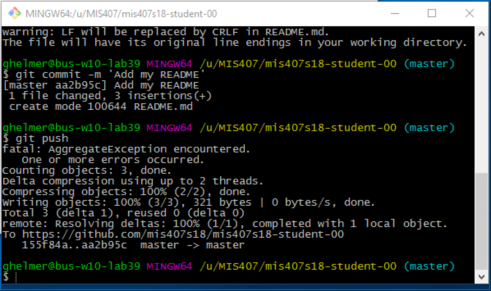
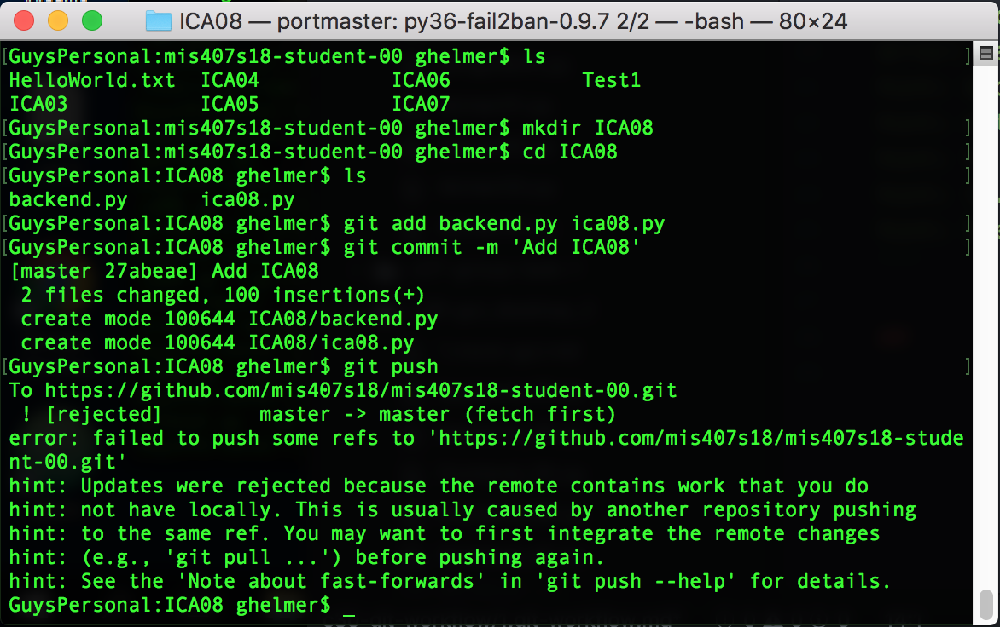
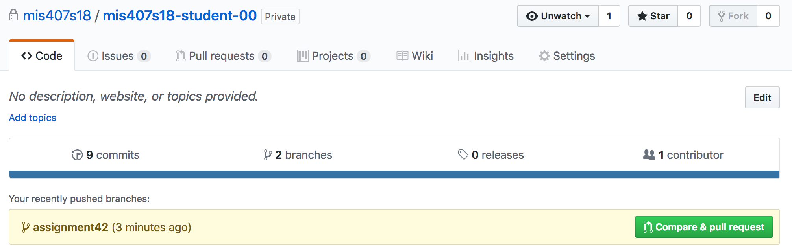
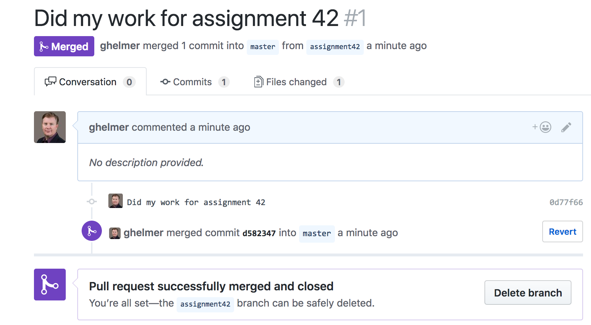

# Git workflow

Git can be unfriendly, as many of you have found out the hard way.

## The Problem: Mismatched local and remote

When you commit changes to your mis407f18-student-xx repo on one computer and push to github, and then commit changes to your mis407f18-student-xx repo on another computer and try to push to github, you'll see the troublesome error that the remote is ahead of your branch. The effect is even more pronounced if you commit work in mis407f18-team-x repo, and then try to "git pull" changes from github where another team member has changed the same file.

Here's an example: Say I worked on an assignment on a computer in the lab, and committed my update, and then pushed the change to github so it can be graded:



Later, in class, on my laptop, I do an in-class assignment, commit the change, and try to push:



But github rejects the `git push`:

```
MyLaptop:ICA08 ghelmer$ git push
To https://github.com/mis407s18/mis407s18-student-00.git
 ! [rejected]        master -> master (fetch first)
error: failed to push some refs to 'https://github.com/mis407s18/mis407s18-student-00.git'
hint: Updates were rejected because the remote contains work that you do
hint: not have locally. This is usually caused by another repository pushing
hint: to the same ref. You may want to first integrate the remote changes
hint: (e.g., 'git pull ...') before pushing again.
hint: See the 'Note about fast-forwards' in 'git push --help' for details.
```

You can try to prevent this problem by **always** pulling before you do new work:

```
git pull
<< do your work >>
git add ...
git commit -m ...
git push
```

But this doesn't help when multiple people are committing & pushing to the repository at any time. Any of your team members can commit and push while you're doing your work.

## One Solution: Rebasing

Something that works *somtimes* when the `git push` fails is to pull with the rebase option:

```
git pull --rebase origin master
```

*Rebasing* rewinds your local repo to the point where the remote and your computer agree, pulls in the changes from the remote, and then replays your local changes.

* Note: See this tutorial from Atlassian to help with this process:
https://www.atlassian.com/git/tutorials/comparing-workflows

But when you changed the same file as was changed on the git server, or when a directory is added both on the git server and your local copy, things can go sideways with conflicts. It can be difficult to resolve. Time to talk to your local git expert, or spend hours Googling solutions...

## Better Solution: Always branch & merge

The better approach: If you are working with others on a Git project, **or if you are working on multiple computers on a Git project**, learn to follow the blessed approach: **always make a new branch before you make a change**.

Again, **always work on a new branch**.

This is a more complex workflow:

1. Start a new branch: `git checkout -b assignment9 master` - creates new branch `assignment9` from `master`

1. Do your work: change files, `git add` the changes, and `git commit`

1. Push your *new branch* to the server: `git push --set-upstream origin assignment9`. You must use the `--set-upstream` option to make git link the local `assignment9` branch to the remote server's `assignment9` branch:
```
$ git push --set-upstream origin assignment9
Counting objects: 3, done.
Delta compression using up to 8 threads.
Compressing objects: 100% (3/3), done.
Writing objects: 100% (3/3), 317 bytes | 317.00 KiB/s, done.
Total 3 (delta 1), reused 0 (delta 0)
remote: Resolving deltas: 100% (1/1), completed with 1 local object.
To https://github.com/mis407s18/mis407s18-student-00.git
 * [new branch]      assignment9 -> assignment9
Branch assignment9 set up to track remote branch assignment9 from origin.
```

1. Merge your *new branch to master* **on the server** using a *pull request*:

Click the button to make a pull request, fill out the form & create the request, and then click the merge button to finish the merge.


1. On your computer, **be sure you're in the base directory of the repo**, checkout the master branch, and git pull:
```
$ pwd
/t/MIS407/mis407s18-student-00
$ git checkout master
Switched to branch 'master'
Your branch is up-to-date with 'origin/master'.
```
(If your current directory is a subdirectory that **isn't** in the master branch, the directory will *disappear* when you do a `git checkout`, and git will be completely confused. This is bad - time to call an expert.)

1. Finally, do a `git pull` to pull down the changes from the git server -- which now includes your changes from the merged branch:
```
$ git pull
remote: Counting objects: 1, done.
remote: Total 1 (delta 0), reused 0 (delta 0), pack-reused 0
Unpacking objects: 100% (1/1), done.
From https://github.com/mis407s18/mis407s18-student-00
   ba2c7c5..d582347  master     -> origin/master
Updating ba2c7c5..d582347
Fast-forward
 README.md | 1 +
 1 file changed, 1 insertion(+)
```

## IRL: Branch Names

We use naming schemes to identify branches: type of change, the programmer's identity, the ticket name referring to the task or bug for the change, and the branch on which the new branch is based.

My team uses:
1. Type: A new `feature`, a `bugfix`, or an urgent `hotfix`
1. User: E.g., ghelmer
1. Ticket: E.g., ABS-56789 documenting the new feature (relates to the task planning / bug tracking system)
1. Base branch: E.g. `develop` branch (used for new features)

For example, I'd create a branch named `feature/ghelmer_ABS-56789_develop`. Using this naming strategy, other team members know what the branch is for, who created it, what branch to merge it to, and what task it was for.
