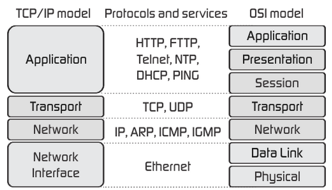

# Web Apps 1

 We will by seeing how to build Web based apps using python. Later, we'll see how to deploy web applications using cloud services such as Heroku and Amazon Web Services.

## Web App Development in Python

How do we develop Web apps in Python?

Though you could always develop your own set of class and methods, it's probably best to build off what others have done. Even simple web apps quickly become unmanageably convoluted and complex (speaking from hard-learned experience) if they are not developed in way that organizes the application using a well-defined architecture. Typical layers in a web application include:
* Data access layer (DAL) - Interface to data sources such as databases
* Data model layer - how data is organized, without any attached business logic
* Controller - business logic that actually works with the data
* View - user interface to the controller logic

(These layers make up the popular Model-View-Controller (MVC) layers in web applications.)
A web application framework enables quickly building a web application in a best-practice organization of the application layers. At the very least, a web application framework manages the HTTP/HTTPS connections with the browser, processes the HTTP GET/POST requests & delivers them to the controller code for processing, and sends the HTTP responses back to the browser. More complete web application frameworks provide more functionality, including:
* Database connection management
* Server startup / crash logging / service restarting
* Session management - including enforcing user authentication to determine access to data

There are many python web frameworks available. These frameworks include many of the basic functions you'll need to write any web based application (see: https://wiki.python.org/moin/WebFrameworks). Some of the most popular python web frameworks include Django and Flask. We will be using Flask (for a recent comparison look [here](https://www.airpair.com/python/posts/django-flask-pyramid).)

Flask is what is called a "micro framework". It works well, and is quite flexible. Many companies use this framework. Django is another - it's a considerably more complex framework, and has a steeper learning curve than Flask. For this course, we will use Flask.

If you want to get serious with web development, learn Javascript (best done with a popular Javascript framework such as AngularJS or ReactJS) for the "front end" that actually runs in the browser, and Django for the "back end". SQLite is handy for single-user or small applications, but Postgresql, MySQL, Oracle, or MS SQLServer are better choices for typical web applications.

## Service options

Later, we'll see how we can deploy our applications to "the cloud" using the popular cloud based platform Heroku (they have a free version that you will need to sign up for, and will be sufficient for our needs). Heroku is one of many examples of of PaaS (Platform as a service) cloud provider (for a recent comparison look [here](https://www.g2crowd.com/categories/platform-as-a-service-paas))  

__NOTE:__ To build and deploy cloud based python web applications, you will first need to create a web application on your local machine.  In this class, we'll discuss how we do this using Flask.

__NOTE2:__ Do the limited time we have in this course, we cannot cover databases in detail. SQLite is a handy starting point for application development, but if you plan to do some serious DB coding, look at the library SQLAlchemy. This library works with any one of several databases, including SQLite, Postgresql, MySQL, Oracle, and others.

## Basic Web Site Architecture technology

In case you're not already familiar (or need a refresher) we'll need to begin by introducing general web application architecture.

NOTE: I will speak to this more than you see written here. If you're not familiar with web architecture, you may want to take notes, and do some further research online.

The Internet (capital 'I') exists because of non-proprietary protocols IP, TCP, HTTP, and SSL/TLS. Protocols are the rules that allow disparate systems to "talk" a common language.



(discuss the above network models)

At the _web application layer_, HTTP servers listen to HTTP requests from web browsers and respond with appropriate Web page content. HTML (Hypertext Markup Language) and CSS (Cascading Style Sheets) are two of the core technologies used for Web page content. These standards (CSS and HTML) are not networking standards, but rather standard for how information is coded and displayed -- and by which it interpreted and "rendered" by HTML browsers. HTML provides the structure of the page, CSS the (visual and aural) layout.

Once a HTTP server response to a request (from an HTML Client, or as we've see -- our own python programs), the data is transported using HTTP (or HTTPS if it's encrypted). Once the content is received by a web browser client, the HTML/CSS content is rendered and displayed. But, this data could also be encoded in other formats -- as we have seen when using our API calls (which were using HTTP as the protocol, but the data wasn't meant to be "rendered" directory by a browser, rather interpreted and read by another program). For display of "web content", the loading of a "page" often involves many transactions between the web client and the HTTP server -- as images, and other resources, are needed before the page can be fully rendered. This exchange of information can also occur later as the display of a page changes under the control of Javascript or HTML5 code.

Web page content can either be "static" or "dynamic".
* Static content is stored as files on the web server
* Dynamic content is generated on-the-fly by software/code on the web server
There are many, many, options for creating dynamic websites (we'll be using Python, obviously). Web clients can also be dynamic and accept code (Javascript is standard) from the HTTP server that that the browser executes to programmatically respond to user requests in a rich fashion.

For our Python Cloud deployment, our Python code will create content that will be "served" via HTTP to the requesting Web Client (HTML Browser).

## Building websites with Flask

Since our app will interact with users via the Web, we'll need to include a web development framework in our development process. For this project we'll use Flask.

### Your "Hello World" Flask server

First, you'll need to install Flask.

```
pip install flask
```

Now, we can use Python to create a local Web Application. Let's start with a simple "Hello World" app.

```python

from flask import Flask

# Create a flask application object and provide a variable name , in this case "app"
# The name given provided in the Flask initialization  is used to resolve resources
# from inside the package. Unless you are using flask within a custom package you'
# re creating, simply put __name__ here.
app = Flask(__name__)

# Set our homepage using the app.route decorator....
@app.route('/')
def home():
    return "Hello world!"

# run the Flask app (which will launch a local webserver)
if __name__ == "__main__":
    app.run(host="0.0.0.0", port=8080, debug=True)

```
[^flask01.py^](sample_code/flask01.py)

### app.run parameters

* app.run's `host` parameter: This is the local IP address on which the server is listening. Host 0.0.0.0 means "all interfaces", including localhost (127.0.0.1) (sometimes called "loopback") and any IP addresses assigned statically by configuration or dynamically by DHCP. If you instead specific localhost only (127.0.0.1), only clients on the computer itself (local to your machine) will be able to access your server.

* app.run's `port` parameter: Set the port to anything you want, so long as the number is in the range 1024 to 65535, and nothing else already running on this TCP port. The standard HTTP port is port 80, but servers must be running with admin privileges to use ports 1-1023. A common port to use for developing web applications is port 8080. The default port for Flask is 5000. (Generally, it's a good rule to stay away from any ports lower than 5000, since a number of applications on computers typically use ports in the lower numbers.)

* app.run's `debug` parameter: Set the debug flag to `True` to ease debugging of the application. In debug mode:
  * the debugger will start when an unhandled exception occurs
  * the application will automatically reload if changes in the code are detected (which is very handy when you are frequently changing your code).

### Testing your service

From the command prompt start our program `flask01.py` and point your browser to http://127.0.0.1:8080/ to see the results. You now have your own webserver running that will simply return the string "Hello World".

You can also access this server by pointing your browser to http://localhost:8080/

Later we will write code to return HTML pages and apply CSS styling to your HTML. For now, just make sure you understand the basic application above.

### Flask Decorators

Notice the line containing `@app.route()`. This is a decorator! They're back (queue the horror music). But, this time we won't have to write our own decorators -- we simply will use that ones that are provided by the Flask library. We'll look deeper at this, and other topics, next class.
